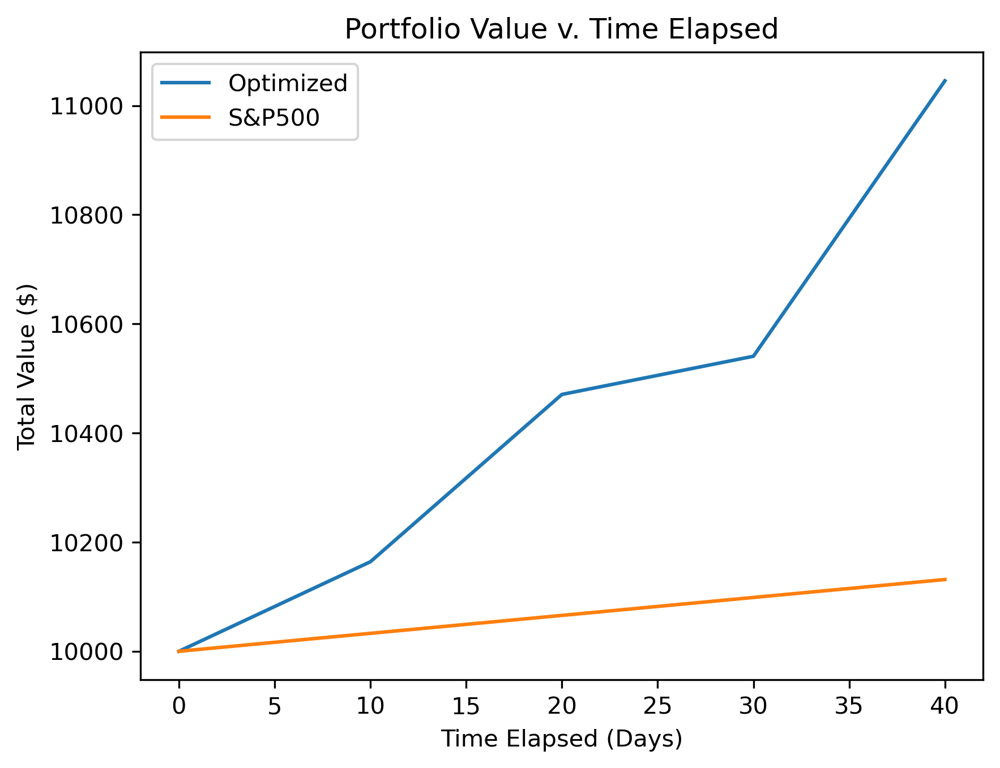
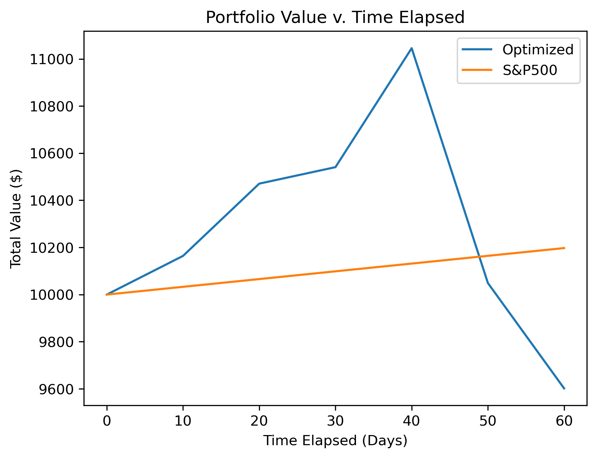
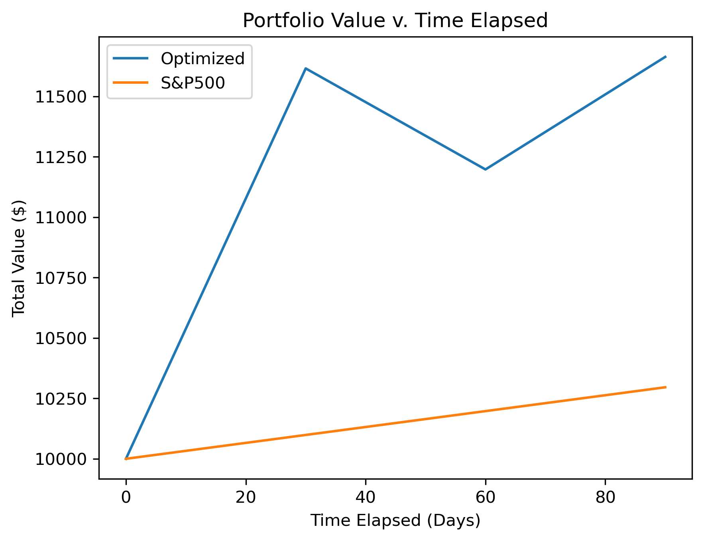
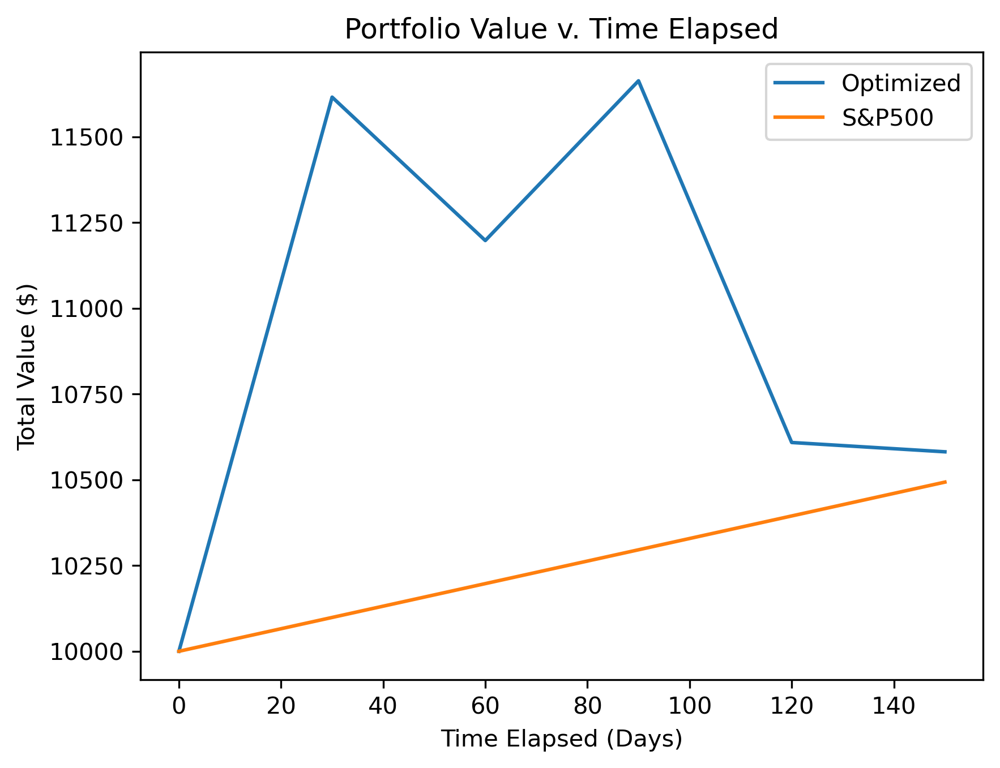

# 📈 Stock Portfolio Optimizer

[](https://www.python.org/downloads/)
[](https://fastapi.tiangolo.com/)
[](https://scikit-learn.org/)
[](https://www.cvxpy.org/)
[](https://aws.amazon.com/)

An ML-powered portfolio optimization platform that combines advanced machine learning with modern portfolio theory to deliver optimal asset allocation strategies. Built with a custom backtesting engine, RESTful API, and full AWS deployment.

🌐 **Live Demo**: [Click_Me!](https://d2h8y2m1123u28.cloudfront.net)

## 🎯 Project Overview

This system implements a complete end-to-end quantitative finance pipeline that bridges the gap between theoretical portfolio optimization and practical trading strategies. By leveraging ensemble machine learning for return prediction and convex optimization for risk-adjusted portfolio construction, the platform demonstrates significant outperformance against benchmark indices.

**Core Capabilities:**
- **Machine Learning Forecasting**: Random Forest ensemble models predict next-day returns using engineered technical features
- **Convex Optimization**: CVXPY-powered mean-variance optimization with configurable risk constraints
- **Walk-Forward Backtesting**: Custom-built time-series validation engine with realistic rebalancing simulation
- **Production API**: FastAPI backend serving real-time portfolio recommendations
- **Cloud Infrastructure**: Fully deployed on AWS with EC2, S3, and CloudFront

## 🏆 Performance Results

The system consistently outperforms the S&P 500 benchmark (approximately 12% annual returns) when the model is trained to predict near-term returns. As the forecast horizon increases, performance degrades and the model no longer achieves the same level of excess returns. However, it is noteworthy that increasing the test window length extends the duration over which the strategy remains profitable. This behavior may be attributed to reduced return volatility when using larger evaluation windows or simply a easily predictable sequence of trading data within the dataset. Results from several test configurations are shown below.

### Backtest Configuration: 10 Test Days, 4 Cycles (40 days)


### Backtest Configuration: 10 Test Days, 6 Cycles (60 days)


### Backtest Configuration: 30 Test Days, 3 Cycles (90 days)


### Backtest Configuration: 30 Test Days, 5 Cycles (150 days)


**Key Performance Metrics:**
- **Annualized Returns**: Consistently exceeds S&P 500 baseline (12% annual return)
- **Risk-Adjusted Performance**: Optimized Sharpe ratios through systematic risk management
- **Drawdown Protection**: Reduced volatility via dynamic diversification

## 🏗️ System Architecture

```
StockPortfolioOptimizer/
├── src/
│   ├── main.py                    # Orchestration & visualization pipeline
│   ├── backtest_engine.py         # Custom backtesting framework
│   ├── walk_forward_backtest.py   # Time-series cross-validation
│   ├── train_models.py            # ML model training pipeline
│   ├── model_predictions.py       # Prediction & covariance estimation
│   ├── optimized_weights.py       # Portfolio optimization solver
│   ├── download_stock_data.py     # Yahoo Finance API integration
│   ├── save_next_day_data.py      # Real-time data acquisition
│   ├── next_day_weights.py        # Live portfolio recommendations
│   └── config.py                  # Path configuration
├── api.py                         # FastAPI REST endpoints
├── frontend/
│   ├── index.html                 # Web interface
│   └── script.js                  # Client-side logic & API calls
├── models/                        # Serialized ML models (.pkl)
├── data/raw/                      # Historical & live market data
├── results/                       # Backtest visualizations
├── notebooks/                     # Research & exploratory analysis
├── Dockerfile                     # Container configuration
└── requirements.txt               # Python dependencies
```

## 🔬 Technical Methodology

### 1. Feature Engineering & Data Pipeline

**Data Sources**: Yahoo Finance API (yfinance) for historical OHLCV data  
**Feature Set**: 11 engineered features per asset:

- **Momentum Features**: Lagged returns (1-day, 5-day, 10-day)
- **Volatility Indicators**: Rolling standard deviation (5-day, 20-day windows)
- **Trend Indicators**: Rolling mean returns (5-day, 20-day windows)
- **Market Correlation**: Cross-correlation with market average (5-day rolling)
- **Volume Analysis**: Volume moving averages and percentage changes

**Data Processing**:
- Time-series aligned feature construction
- Forward-fill handling for missing data
- Date-indexed pandas DataFrames for temporal consistency

### 2. Machine Learning Models

**Algorithm**: Random Forest Regression
- **Hyperparameters**: 200 estimators, random_state=42 for reproducibility
- **Architecture**: Separate model trained for each ticker to capture asset-specific dynamics
- **Target Variable**: Next-day return (configurable horizon: 1-20 days)
- **Validation**: 80/20 time-series split with chronological ordering preserved
- **Serialization**: Joblib-pickled models for production deployment

**Model Training Metrics**:
- Mean Squared Error (MSE) for prediction accuracy
- Root Mean Squared Error (RMSE) for interpretable error magnitude
- Per-ticker performance tracking for model diagnostics

### 3. Portfolio Optimization Framework

**Markowitz Mean-Variance Optimization** with CVXPY:

```python
Objective:
  maximize: μᵀw - λ · wᵀΣw

Constraints:
  Σwᵢ = 1           # Full capital deployment
  wᵢ ≥ 0            # Long-only (no short selling)
  wᵢ ≤ 0.40         # Position size limits (max 40% per asset)
```

**Variables**:
- `μ` : Expected return vector from ML predictions
- `Σ` : Asset covariance matrix (estimated from historical returns)
- `w` : Portfolio weight vector (optimization variable)
- `λ` : Risk aversion parameter (default: 100)

**Risk Management**:
- Quadratic risk penalty enforces diversification
- Position limits prevent concentration risk
- Covariance matrix captures asset co-movements

### 4. Walk-Forward Backtesting Engine

**Custom Implementation** (`backtest_engine.py`):

Simulates realistic portfolio performance with:
- **Dynamic Rebalancing**: Weights updated each period using latest predictions
- **Time-Series Validation**: Train window rolls forward to prevent look-ahead bias
- **Performance Metrics**:
  - Total Return & CAGR (Compound Annual Growth Rate)
  - Daily Volatility & Annualized Sharpe Ratio
  - Drawdown analysis & ending portfolio value

**Backtest Configuration**:
```python
num_train_days = 60      # Training window size
num_test_days = 30       # Out-of-sample test period
num_cycles = 5           # Number of walk-forward iterations
```

**Process Flow**:
1. Train models on initial window (60 days)
2. Generate predictions for test period (30 days)
3. Optimize portfolio weights using predictions
4. Simulate daily returns with optimized allocation
5. Roll training window forward and repeat

## 🚀 Key Features

### Backend & ML Infrastructure
- ✅ **Custom Backtesting Engine**: Vectorized simulation with realistic rebalancing costs
- ✅ **Walk-Forward Validation**: Time-series cross-validation prevents data leakage
- ✅ **RESTful API**: FastAPI with Pydantic validation and CORS middleware
- ✅ **Real-Time Data Integration**: yfinance API for live market data
- ✅ **Model Persistence**: Joblib serialization for production model serving
- ✅ **Modular Architecture**: Clean separation of concerns for maintainability

### Frontend & User Experience
- ✅ **Interactive Web Interface**: TailwindCSS-styled responsive design
- ✅ **Real-Time Optimization**: Submit tickers and receive instant portfolio recommendations
- ✅ **Visualization**: Portfolio weight distribution and expected metrics
- ✅ **Input Validation**: Client-side checks for ticker symbols and budget constraints

### DevOps & Deployment
- ✅ **Docker Containerization**: Reproducible deployment environment
- ✅ **AWS EC2 Backend**: Scalable compute for model inference
- ✅ **S3 + CloudFront Frontend**: CDN-delivered static assets for low latency
- ✅ **Health Check Endpoints**: Monitoring-ready API status routes
- ✅ **Environment Configuration**: Secure credential management

## 📊 Supported Assets

Current universe includes 10 liquid, large-cap equities across sectors:

| Sector | Ticker | Company |
|--------|--------|----------|
| **Technology** | AAPL | Apple Inc. |
| **Technology** | MSFT | Microsoft Corp. |
| **Technology** | NVDA | NVIDIA Corp. |
| **Technology** | AMZN | Amazon.com Inc. |
| **Healthcare** | JNJ | Johnson & Johnson |
| **Financial** | JPM | JPMorgan Chase |
| **Energy** | XOM | Exxon Mobil |
| **Energy** | NEE | NextEra Energy |
| **Industrial** | CAT | Caterpillar Inc. |
| **Consumer** | PG | Procter & Gamble |

## 🛠️ Installation & Setup

### Local Development

**Prerequisites:**
- Python 3.11+
- pip package manager
- Git

**Installation Steps:**

```bash
# Clone repository
git clone https://github.com/yourusername/StockPortfolioOptimizer.git
cd StockPortfolioOptimizer

# Create virtual environment
python -m venv venv
source venv/bin/activate  # Windows: venv\Scripts\activate

# Install dependencies
pip install -r requirements.txt
```

### Running the API Server - IMPORTANT: When running the backend, ensure that all import statements to the src module contain a '.' in front of the file name. The '.' must be removed when running the packtest engine through main.py

```bash
# Start FastAPI backend
uvicorn api:app --reload --host 0.0.0.0 --port 8000

# API available at http://localhost:8000
# Interactive docs at http://localhost:8000/docs
```

### Docker Deployment

```bash
# Build container
docker build -t portfolio-optimizer .

# Run container
docker run -p 8000:8000 portfolio-optimizer
```

## 💻 Usage Examples

### 1. Training Models

```bash
cd src
python train_models.py
```

**Output:**
```
AAPL Test MSE: 0.000234, RMSE: 0.015297
AAPL model trained and saved.

MSFT Test MSE: 0.000189, RMSE: 0.013748
MSFT model trained and saved.
...
```

### 2. Running Backtests

```bash
cd src
python main.py
```

**Sample Output:**
```
Optimal weights: [0.18 0.25 0.22 0.15 0.05 0.08 0.03 0.02 0.01 0.01]

Backtest Results:
├── Total Return: 15.32%
├── CAGR: 11.87%
├── Daily Volatility: 1.42%
├── Sharpe Ratio: 2.14
└── Final Portfolio Value: $11,532.00

S&P 500 Baseline: $11,200.00 (12% annualized)
Outperformance: +2.96%
```

### 3. API Usage

**Submit Portfolio Request:**

```bash
curl -X POST "http://localhost:8000/submit-portfolio" \
  -H "Content-Type: application/json" \
  -d '{
    "tickers": ["AAPL", "MSFT", "NVDA", "AMZN"],
    "initial_value": 10000,
    "weights": [],
    "expected_return": 0,
    "expected_variance": 0
  }'
```

**Response:**
```json
{
  "status": "done",
  "tickers": ["AAPL", "MSFT", "NVDA", "AMZN"],
  "initial_value": 10000,
  "weights": [0.28, 0.31, 0.25, 0.16],
  "expected_return": 124.35,
  "expected_variance": 0.00023
}
```

### 4. Web Interface

Access the deployed frontend at: [Frontend](d2h8y2m1123u28.cloudfront.net)

1. Enter 3+ tickers from supported list (comma-separated)
2. Specify initial portfolio value
3. Click "Optimize Portfolio"
4. View recommended weights and expected metrics

## 🔍 Technical Highlights

### Machine Learning Engineering
- **Production ML Pipeline**: Automated training, validation, and serialization workflow
- **Feature Engineering**: Domain-informed technical indicators from financial theory
- **Model Diagnostics**: Per-asset performance tracking and error analysis
- **Ensemble Methods**: Random Forest reduces overfitting vs. single decision trees

### Quantitative Finance
- **Modern Portfolio Theory**: Implementation of Nobel Prize-winning framework (Markowitz, 1952)
- **Risk Decomposition**: Variance-covariance approach to portfolio risk
- **Constraint Optimization**: Practical investment constraints (position limits, long-only)
- **Performance Attribution**: Sharpe ratio and risk-adjusted return metrics

### Software Engineering
- **API Design**: RESTful FastAPI with OpenAPI documentation
- **Containerization**: Docker for reproducible deployments
- **Cloud Architecture**: Multi-tier AWS deployment (compute + CDN)
- **Code Organization**: Modular Python package structure with clear separation of concerns
- **Configuration Management**: Centralized path handling and environment variables

### DevOps & Infrastructure
- **AWS EC2**: Scalable backend compute with health monitoring
- **S3 + CloudFront**: Global CDN for frontend asset delivery
- **CORS Configuration**: Secure cross-origin API access
- **Logging**: Structured logging to stdout for cloud log aggregation

## 📈 Performance Metrics & Evaluation

### Portfolio Analytics Provided

| Metric | Description | Interpretation |
|--------|-------------|----------------|
| **Optimal Weights** | Asset allocation percentages | Portfolio composition |
| **Expected Return** | Predicted dollar return | Absolute profit target |
| **Portfolio Variance** | Risk measure (σ²) | Volatility squared |
| **Sharpe Ratio** | Return per unit risk | Risk-adjusted performance |
| **CAGR** | Annualized return | Comparable growth rate |
| **Max Drawdown** | Peak-to-trough decline | Worst-case loss scenario |

### Benchmark Comparison

All backtests compare against **S&P 500 baseline** (12% annualized return) to demonstrate alpha generation and strategy efficacy.

## 📚 Project Components

### Core Modules

- **`backtest_engine.py`**: Vectorized simulation engine with realistic transaction modeling
- **`walk_forward_backtest.py`**: Time-series cross-validation orchestration
- **`train_models.py`**: ML training pipeline with hyperparameter configuration
- **`model_predictions.py`**: Inference engine with covariance matrix estimation
- **`optimized_weights.py`**: CVXPY convex optimization solver
- **`download_stock_data.py`**: Historical data acquisition and feature engineering
- **`next_day_weights.py`**: Real-time portfolio recommendation system

### API Endpoints

- **`GET /`**: Root endpoint health check
- **`GET /health`**: Lightweight status for monitoring
- **`POST /submit-portfolio`**: Portfolio optimization request handler

### Frontend

- **`index.html`**: Responsive web interface with TailwindCSS
- **`script.js`**: API client with validation and error handling

## 🧪 Future Enhancements

**Immediate Priorities:**
- [ ] Transaction cost modeling (brokerage fees, slippage)
- [ ] Multi-period rebalancing optimization
- [ ] Sector exposure constraints

**Advanced Features:**
- [ ] LSTM/Transformer models for sequential return prediction
- [ ] Black-Litterman model for Bayesian return estimation
- [ ] Fama-French factor models for attribution analysis
- [ ] Options overlay strategies (covered calls, protective puts)
- [ ] Cryptocurrency and alternative asset support

**Infrastructure:**
- [ ] PostgreSQL for historical data storage
- [ ] Redis caching for model predictions
- [ ] Kubernetes deployment for auto-scaling
- [ ] Real-time streaming data (WebSocket feeds)
- [ ] Automated model retraining pipelines

## 📖 Theoretical Foundations

### Markowitz Mean-Variance Optimization (1952)
The cornerstone of modern portfolio theory, formulating portfolio selection as a convex optimization problem. Investors maximize expected return for a given level of risk (variance), yielding the efficient frontier of optimal portfolios.

### Random Forest Regression (Breiman, 2001)
Ensemble learning method constructing multiple decorrelated decision trees via bootstrap aggregation. Reduces overfitting while capturing non-linear relationships in financial time series through feature randomization.

### Sharpe Ratio (Sharpe, 1966)
Risk-adjusted performance metric computing excess return per unit of volatility. Enables comparison across strategies with different risk profiles.

## 🔐 Security & Best Practices

- **API Security**: CORS middleware with whitelisted origins
- **Input Validation**: Pydantic models enforce type safety
- **Error Handling**: Graceful degradation with informative error messages
- **Logging**: Structured logs for debugging and monitoring
- **Environment Variables**: Sensitive credentials isolated from codebase

## 📦 Dependencies

```
fastapi==0.124.0          # Modern async web framework
uvicorn==0.38.0           # ASGI server
pandas==2.3.3             # Data manipulation
scikit-learn==1.6.1       # Machine learning
joblib==1.4.2             # Model serialization
cvxpy==1.5.3              # Convex optimization
yfinance==0.2.66          # Market data API
numpy==2.3.3              # Numerical computing
scipy==1.16.2             # Scientific computing
python-multipart==0.0.20  # Form data parsing
python-dotenv==1.1.1      # Environment management
pydantic==2.12.5          # Data validation
```

## 👤 Author

**Nickolas Regas**

This project demonstrates production-level expertise in:

✅ **Quantitative Finance**: Portfolio theory, risk management, performance attribution  
✅ **Machine Learning**: Ensemble methods, feature engineering, time-series forecasting  
✅ **Software Engineering**: API design, containerization, cloud deployment  
✅ **DevOps**: AWS infrastructure, Docker, CI/CD readiness  
✅ **Full-Stack Development**: Backend (Python/FastAPI) + Frontend (HTML/JS)  

**Relevant Skills for Quant/Fintech/Big Tech Roles:**
- Algorithmic trading system design
- Large-scale data pipeline engineering
- Production ML model deployment
- Cloud-native application architecture
- Quantitative research and backtesting

---

## 📄 License

This project is available for educational and research purposes.

---

⭐ **If this project demonstrates the technical rigor you're looking for in a candidate, let's connect!**
